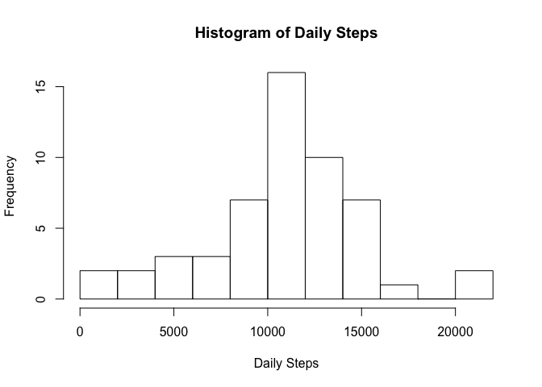
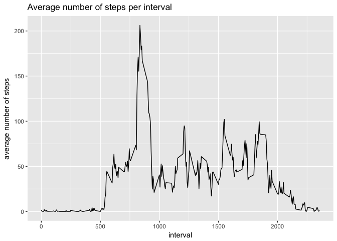
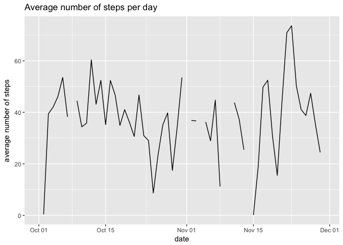
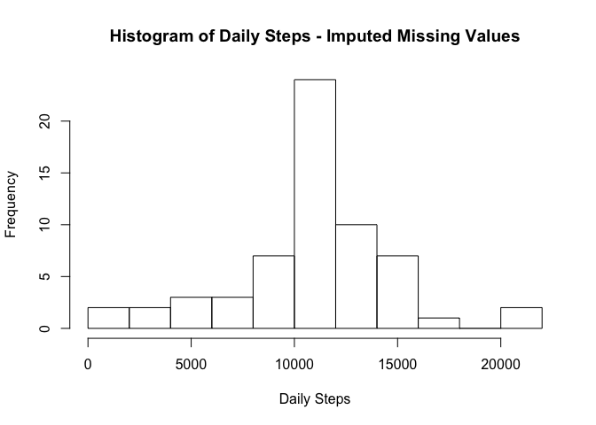
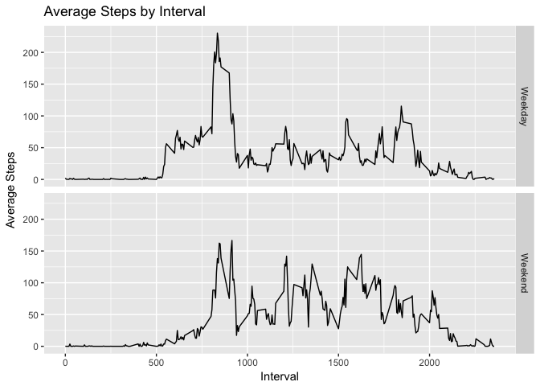
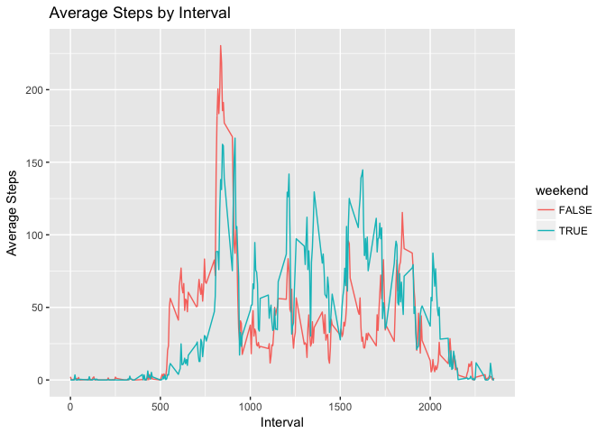

# Course Project 1

This report a brief report summarizing findings about the personal movement data. Before running this code is important that you have installed the following packages
-dplyr
-lubridate
-ggplot2
-chron
then you have to install the libraries

```r
library(lubridate)
```

```
## 
## Attaching package: 'lubridate'
```

```
## The following object is masked from 'package:base':
## 
##     date
```

```r
library(dplyr)
```

```
## 
## Attaching package: 'dplyr'
```

```
## The following objects are masked from 'package:lubridate':
## 
##     intersect, setdiff, union
```

```
## The following objects are masked from 'package:stats':
## 
##     filter, lag
```

```
## The following objects are masked from 'package:base':
## 
##     intersect, setdiff, setequal, union
```

```r
library(chron)
```

```
## 
## Attaching package: 'chron'
```

```
## The following objects are masked from 'package:lubridate':
## 
##     days, hours, minutes, seconds, years
```


##The data
This device collects data at 5 minute intervals through out the day. The data consists of two months of data from an anonymous individual collected during the months of October and November, 2012 and include the number of steps taken in 5 minute intervals each day.

We are not required to show the code for downloading the data, but just for completeness sake, here it is:

```r
#Download and unzip file
setwd("~/DataScience/5 - Reproducible Research/Course Project 1")
fileUrl<-"https://d396qusza40orc.cloudfront.net/repdata%2Fdata%2Factivity.zip"
download.file(fileUrl, destfile="repdata_data_activity.zip", method="curl")
unzip("repdata_data_activity.zip",overwrite=TRUE)
dateDownloaded <- date()
dateDownloaded
```

## Step 1 - Loading and processing the data 

```r
data <- read.table("activity.csv",header=TRUE,sep=",",na.string="NA",stringsAsFactors=FALSE)
data$date <- ymd(data$date)
data <- tbl_df(data)
data$weekend = chron::is.weekend(data$date) #Create a weekend variable for to be used in Step #6
```

## Step 2 - Plot histogram of total steps per day

```r
daily_data<- data %>% group_by(date) %>% 
        summarise(tot_steps=sum(steps), mean_steps=mean(na.omit(steps)))

hist(daily_data$tot_steps, 
        breaks = 10,
        main = "Histogram of Daily Steps",
        xlab ="Daily Steps")
```

<!-- -->

## Step 3 - Mean and Median steps per day Table

```r
mean(daily_data$tot_steps, na.rm=TRUE)
```

```
## [1] 10766.19
```

```r
median(daily_data$tot_steps, na.rm=TRUE) 
```

```
## [1] 10765
```

## Step 4 - Time series plot of the average number of steps taken
The assignment instructions were not really clear. In one part it states "Make a time series plot (i.e. type = "l") of the 5-minute interval (x-axis) and the average number of steps taken, averaged across all days (y-axis)". According to that description, this is what I came up with:

```r
max_interval<- data %>% group_by(interval) %>% 
        summarise(mean_steps=mean(na.omit(steps)))

library(ggplot2)
g <- ggplot(max_interval, aes(interval,mean_steps)) + 
        geom_line() +
        xlab("interval") + 
        ylab("average number of steps" ) +
        ggtitle ("Average number of steps per interval")
g
```

<!-- -->

However, the instructions also simply state "Time series plot of the average number of steps taken". I interpret that to have time in the x-axis and the average number of steps on the y-axis as follows:

```r
g <- ggplot(daily_data, aes(date,mean_steps)) + 
        geom_line() +
        xlab("date") + 
        ylab("average number of steps" ) +
        ggtitle("Average number of steps per day")
g
```

```
## Warning: Removed 2 rows containing missing values (geom_path).
```

<!-- -->

When reviewing my work, please considered that I am including two graphs for this task only because the assignment description was not very clear to me.

## Step 5 - The 5-minute interval that, on average, contains the maximum number of steps

```r
max_interval<- data %>% group_by(interval) %>% 
        summarise(mean_steps=mean(na.omit(steps))) %>% filter(mean_steps == max(mean_steps))
max_interval
```

```
## # A tibble: 1 × 2
##   interval mean_steps
##      <int>      <dbl>
## 1      835   206.1698
```


As shown above interval # 835 has the highest average of steps with 206.1698113 steps on average. 

## Step 6 - Code to describe and show a strategy for imputing missing data
First let's estimate the number of observations with missing data for the steps variable


```r
sum(is.na(data$steps))
```

```
## [1] 2304
```

Just out of curiosity: What percent of observations is missing data?

```r
sum(is.na(data$steps))/length(data$steps)
```

```
## [1] 0.1311475
```

The methodology I would use to estimate missing values is to replace any given missing value with the average number of steps for that interval. Please note that the 'average' is rounded. I thought it would be appropriate to round the number of steps.

The R code would be as follows:


```r
#Estimate the average number of steps for each interval
mean_interval<- data %>% group_by(interval) %>% 
        summarise(mean_steps=as.integer(mean(na.omit(steps))))

#In this step, replace the missing overvations with the mean # of steps for any given interval.
imputed_data <- merge(data,mean_interval, by.x="interval", all.x=TRUE) %>%
        mutate(imputed_steps = ifelse(is.na(steps), mean_steps, steps))

imputed_data$weekend = chron::is.weekend(imputed_data$date)
```

What is the new meand and media of the imputed data?

```r
imp_daily_data<- imputed_data %>% group_by(date) %>% 
        summarise(tot_steps=sum(imputed_steps), mean_steps=mean(na.omit(imputed_steps)))
mean(imp_daily_data$tot_steps)
```

```
## [1] 10749.77
```

```r
median(imp_daily_data$tot_steps) 
```

```
## [1] 10641
```
Both are lower than what was previously estimated. PLEASE NOTE that this result may be because I rounded the imputed values - I coded the imputed values as.integers.

## Step 7 - Histogram of the total number of steps taken each day after missing values are imputed

```r
hist(imp_daily_data$tot_steps, 
     breaks = 10,
     main = "Histogram of Daily Steps - Imputed Missing Values",
     xlab ="Daily Steps")
```

<!-- -->

## Step 8 - Panel plot comparing the average number of steps taken per 5-minute interval across weekdays and weekends

```r
week_end<- imputed_data %>% group_by(weekend, interval) %>% 
        summarise(mean_steps=mean(na.omit(imputed_steps))) 
labels <- c("TRUE" = "Weekend", "FALSE" = "Weekday")

g <- ggplot(week_end, aes(interval,mean_steps)) + 
        geom_line() + 
        facet_grid(weekend ~ ., labeller=labeller(weekend=labels)) +
        xlab("Interval") +
        ylab("Average Steps")+
        ggtitle("Average Steps by Interval")
g
```

<!-- -->

I though it would make it easier to show the data in the same plot as below. This was not required by the assignment.

```r
g <- ggplot(week_end, aes(interval,mean_steps)) + 
        geom_line(aes(color=weekend)) +
        xlab("Interval") +
        ylab("Average Steps")+
        ggtitle("Average Steps by Interval")
g
```

<!-- -->
